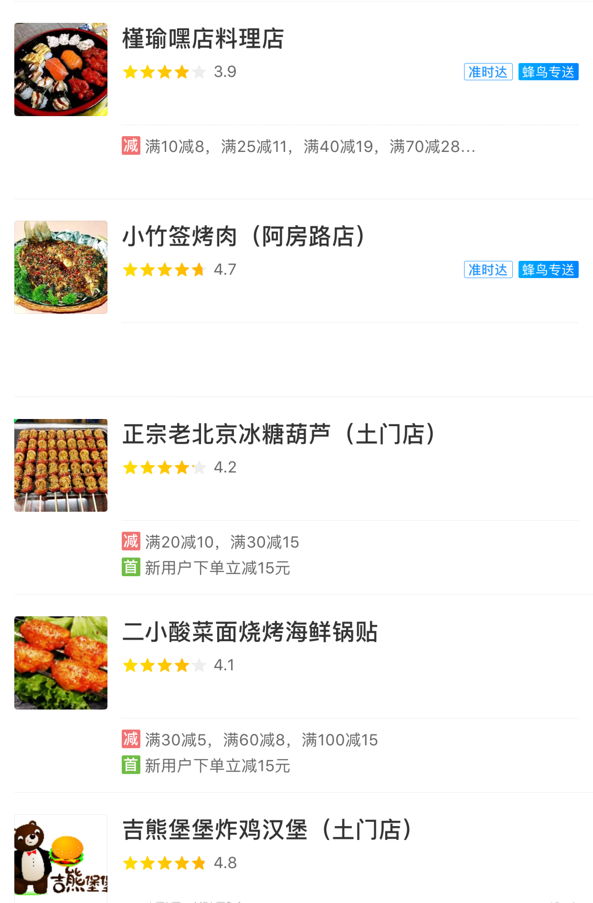

# TDD in iOS

## 需求

```
Feature: 美食
Scenario: 空美食界面
  Given 启动App
  When 进入美食页面
   And 没有店铺数据
  Then 我看不到店铺列表
```

```
Feature: 美食
Scenario: 美食界面
  Given 启动App
  When 进入美食页面
   And 有店铺数据
  Then 我可以看到店铺列表
   And 看到店铺图标
   And 看到店铺名称
   And 看到店铺评星
```

```
Feature: 美食
Scenario: 店铺信息
  Given 启动App
  When 进入美食页面
   And 店铺数据包含一条优惠信息
  Then 我可以看到一条优惠类型
   And 看到一条优惠信息
```

```
Feature: 美食
Scenario: 店铺信息
  Given 启动App
  When 进入美食页面
   And 店铺数据不包含任何优惠信息
  Then 我应该看不到任何优惠类型
   And 看不到任何优惠信息
```

```
Feature: 美食
Scenario: 店铺信息
  Given 启动App
  When 进入美食页面
   And 店铺数据包含多条优惠信息
  Then 我应该看到多条优惠类型
   And 看到多条优惠信息
```

```
Feature: 美食
Scenario: 店铺信息
  Given 启动App
  When 进入美食页面
   And 店铺数据包含准时达信息
  Then 我可以看到准时达
```

```
Feature: 美食
Scenario: 店铺信息
  Given 启动App
  When 进入美食页面
   And 店铺数据不包含准时达信息
  Then 我应该看不到准时达
```

```
Feature: 美食
Scenario: 店铺信息
  Given 启动App
  When 进入美食页面
   And 店铺数据包含蜂鸟专送信息
  Then 我可以看到蜂鸟专送
```

```
Feature: 美食
Scenario: 店铺信息
  Given 启动App
  When 进入美食页面
   And 店铺数据不包含蜂鸟专送信息
  Then 我应该看不到蜂鸟专送
```

## 设计




# IOSTDD
IOSTDD: use Swift create TDD on iOS
